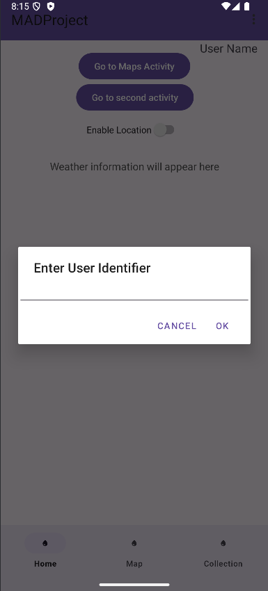
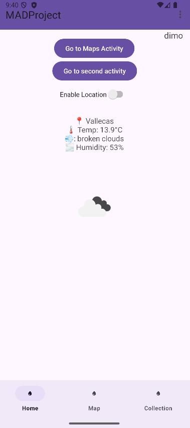
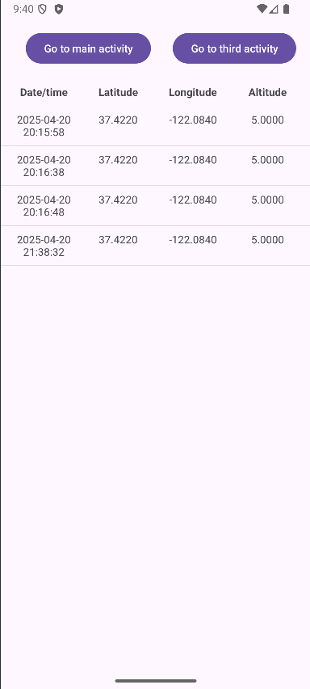
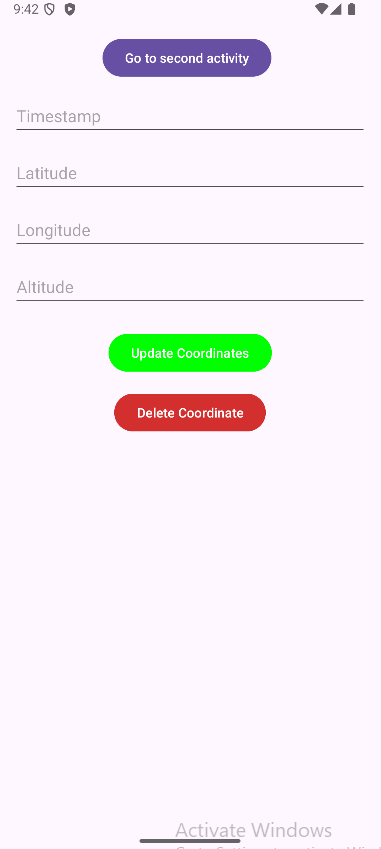
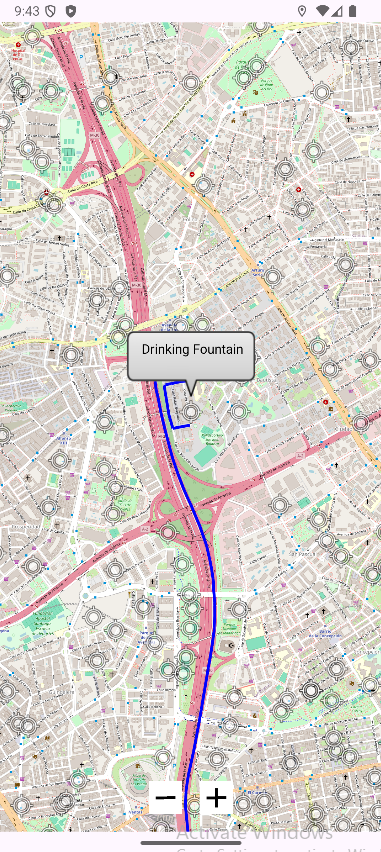
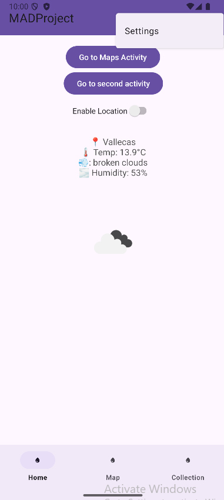
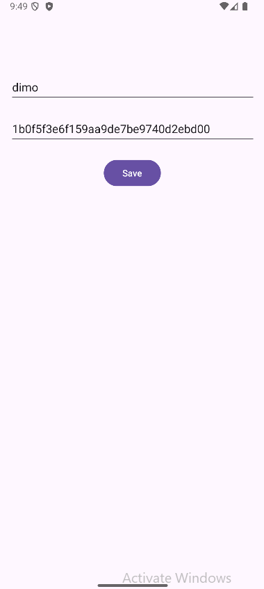

# MADProject

## Workspace 
Github:  
- Repository: https://github.com/dtsekov/MADProject
- Releases: https://github.com/dtsekov/MADProject/releases   

Workspace: https://upm365.sharepoint.com/sites/MADProject/SitePages/Tracking.aspx 
  

## Description
The application provides a fast and convenient way to find a nearby source of drinking water. In addition to offering other features, the main focus of the app is to display the closest drinking water fountains and, upon selecting one, show the shortest route to reach it. Such applications are typically developed by companies that display only their own water fountains. In contrast, my application uses an open database from the city of Madrid to show all available public drinking fountains. By focusing exclusively on drinking water fountains, it simplifies the process of finding one, making it quick, easy, and efficient.

## Screenshots and navigation

<table>
  <tr>
    <td>
      
      
This is the screen that greets you when you first install the app, it will prompt you to enter a UserID that will be saved in SharedPreferences.

    </td>
    <td>
      
      
This is the main screen of the aplication, from here you can first see in the middle is the real time weather information based on your current location, if you havent enabled location permissions yet with the toggle button above the weather information, the application will use a default location which is Campus Sur of UPM in Vallecas. From here we can navigate either to the second activity, the Map activity or open the toolbar menu and navigate to the settings activity. We also have the bottom navigation menu from which we can go to the home screen, the map activity, or jump to the second activity.

    </td>
  </tr>
  <tr>
    <td>
      
      
This is the second activity where we can find a list that shows us all the current location updates that we have done. Every time your location changes either from walking or opening the app again, that location is saved and showed here in this list. From here we can either press the button third activity to navigate to the third activity or press on top of a coordinate from the list which will open the third activity where we can edit or delete this specific coordinate.

    </td>
    <td>
      
      
This is the third activity screen, when we enter here through the pressing of a coordinate in the list from second activity, then its information will fill the fields and we can edit any field we want or delete this coordinate from our room database.

    </td>
  </tr>
  <tr>
    <td>
      
      
This is the main function of our application, the Map activity. From here we will see markers on our map that represent a fountain with drinking water, we also have a Current Location marker thats out of the picture and cant be seen. When you press on top of a drinking fountain marker the application does what is shown on the screen, it draws the fastest route to it on the map with a blue line. When clicking on another drinking fountain it deletes the last route and draws the new one, also when you press on your current location marker it also deletes the current route.

    </td>
    <td>
       
      
This is the opened toolbar menu which only has 1 options and that is to navigate us to the settings activity.

    </td>
  </tr>
  <tr>
    <td>
      
      
This is the settings activity, in here we can edit the data that is stored in our shared preferences of the app. We have first the UserID we inputted when first opening the app, then we have an API key which we use to make the calls to the Weather API and show the weather information on the main screen. In my case I use the API key 1b0f5f3e6f159aa9de7be9740d2ebd00.

    </td>
  </tr>
  
</table>

## Demo Video
 
<a href="https://upm365-my.sharepoint.com/:v:/g/personal/d_tsekov_alumnos_upm_es/EdP7nfes7FJCldnBelROnUQBm704poDh5RAd2RkS1sc5bQ?e=osc5Th&nav=eyJyZWZlcnJhbEluZm8iOnsicmVmZXJyYWxBcHAiOiJTdHJlYW1XZWJBcHAiLCJyZWZlcnJhbFZpZXciOiJTaGFyZURpYWxvZy1MaW5rIiwicmVmZXJyYWxBcHBQbGF0Zm9ybSI6IldlYiIsInJlZmVycmFsTW9kZSI6InZpZXcifX0%3D">
Demo video of the app. 
</a>

## Features
**functional**
- Search for drinking water fountains in Madrid.
- Shortest route to water fountains.
- Real-time weather information.
- Storage of location timestamps.

**technical**
- Persistence in shared preferences Ref: [Source code](https://github.com/dtsekov/MADProject/blob/main/app/src/main/java/com/example/madproject/SettingsActivity.kt)
- Persistence in Room database. Ref: [Source code](https://github.com/dtsekov/MADProject/tree/main/app/src/main/java/com/example/madproject/room)
- Maps: Openstreetmaps. Ref: [Source code](https://github.com/dtsekov/MADProject/blob/main/app/src/main/java/com/example/madproject/OpenStreetsMapActivity.kt)
- Restful API Openweathermaps, we use a get call to open weather maps giving them our current location and getting in return weather information. Ref: [Source code](https://github.com/dtsekov/MADProject/blob/main/app/src/main/java/com/example/madproject/network/WeatherApiService.kt)
- Restful API OSRM, used to get the coordinates list of the shortest route to drinking fountains from current location so we can paint it on the map. Ref: [Source code](https://github.com/dtsekov/MADProject/blob/main/app/src/main/java/com/example/madproject/network/OSRMResponse.kt)
- Menu: Toolbar Ref: [Source code](https://github.com/dtsekov/MADProject/blob/main/app/src/main/res/menu/toolbar_menu.xml)
- Menu: Bottom navigation Ref: [Source code](https://github.com/dtsekov/MADProject/blob/main/app/src/main/res/menu/bottom_nav_menu.xml)
- Sensors: GPS coordinates to access current location

## How to Use
As a first time user it is very simple to get started. First enter your UserID which you can change at any time later. After that the only important thing you need to do is enable location permission with the switch button on the main page. After that you can access the rest of the app by pressing on the navigation buttons, either the ones on the main page or the ones in the bottom navigation menu. You can go to the map and on the screen you will see markers displaying the location of the fountains near you and your current location. By pressing on any of the fountains the shortest route will be drawn on the map. If you want another fountain just press on it, the app will automatically remove the previous route and draw the new one. You can also press on your current location marker to clear any routes on your map. The only thing left is the second activity or as the bottom navigation calls it the Collection tab. In here you will see a list of all your location changes history where you will be able to edit it if you want or delete coordinates from the list.

## Participants
List of MAD developers:
- Dimitar Danielov Tsekov  (d.tsekov@alumnos.upm.es)  

